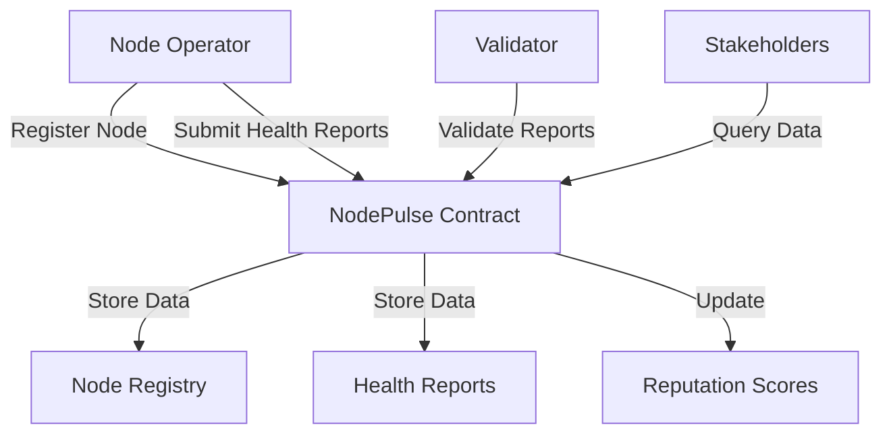

# NodePulse Monitoring System

A decentralized solution for monitoring and verifying the health and performance of Stacks blockchain nodes. NodePulse enables transparent node operation tracking, reputation building, and infrastructure quality assurance through on-chain attestations and validation.

## Overview

NodePulse provides a comprehensive system for:
- Node registration and monitoring
- Health metric submissions and verification
- Reputation scoring based on performance
- Independent validation of node operations
- Transparent performance history tracking

The system creates accountability in node operations while incentivizing reliable infrastructure maintenance through reputation mechanics.

## Architecture

The NodePulse system consists of three main participant types interacting with the smart contract:

1. **Node Operators** - Register nodes and submit health reports
2. **Validators** - Verify submitted health reports
3. **Stakeholders** - Access node performance data



## Contract Documentation

### Core Functionality

The `node-pulse.clar` contract implements:

#### Node Management
- Node registration with metadata
- Health report submission
- Node information updates

#### Validation System
- Validator registration
- Report validation
- Multi-validator consensus

#### Reputation System
- Dynamic score calculation
- Performance-based adjustments
- Temporal decay mechanism

### Key Data Structures

1. **Nodes Map**
   - Stores node registration and metadata
   - Tracks reputation scores and report history

2. **Health Reports Map**
   - Records periodic health attestations
   - Includes uptime and response time metrics

3. **Report Validations Map**
   - Tracks validator submissions
   - Ensures validation integrity

## Getting Started

### Prerequisites
- Clarinet
- Stacks CLI tools

### Basic Usage

1. Register a node:
```clarity
(contract-call? .node-pulse register-node 
    "node-01"
    "My Node"
    "https://mynode.example.com"
    "US-East"
    (list "mining" "stacking"))
```

2. Submit a health report:
```clarity
(contract-call? .node-pulse submit-health-report 
    "node-01"
    u99  ;; uptime percentage
    u150 ;; response time in ms
    u1234) ;; current block height
```

3. Validate a report:
```clarity
(contract-call? .node-pulse validate-health-report 
    "node-01"
    block-height
    true)
```

## Function Reference

### Node Operations

#### `register-node`
```clarity
(define-public (register-node 
    (node-id (string-ascii 50))
    (name (string-utf8 100))
    (url (string-ascii 100))
    (location (string-ascii 50))
    (features (list 20 (string-ascii 50))))
```

#### `submit-health-report`
```clarity
(define-public (submit-health-report 
    (node-id (string-ascii 50))
    (uptime uint)
    (response-time uint)
    (block-height-reported uint))
```

### Validator Operations

#### `register-validator`
```clarity
(define-public (register-validator))
```

#### `validate-health-report`
```clarity
(define-public (validate-health-report
    (node-id (string-ascii 50))
    (report-time uint)
    (is-valid bool))
```

## Development

### Testing

1. Clone the repository
2. Install dependencies:
```bash
clarinet install
```
3. Run tests:
```bash
clarinet test
```

### Local Development
```bash
clarinet console
```

## Security Considerations

### Limitations
- Minimum interval between reports (3600 blocks)
- Maximum uptime value (100%)
- Response time limits (0-10000ms)
- Validator threshold (3 validations required)

### Best Practices
- Always verify node ownership before operations
- Maintain regular health report submissions
- Use multiple validators for report verification
- Monitor reputation score for unexpected changes

### Access Control
- Node operations restricted to registered owners
- Validation limited to registered validators
- Public read access to all node data